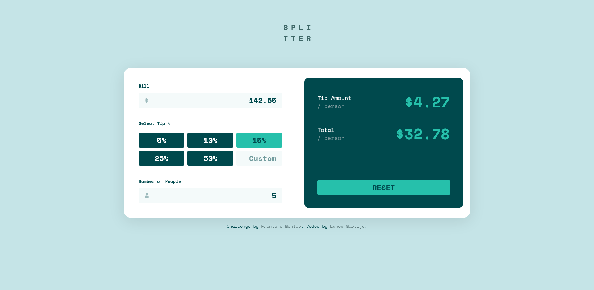
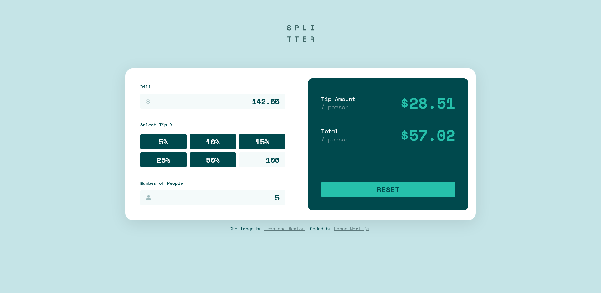
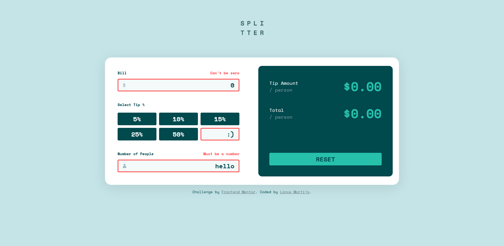
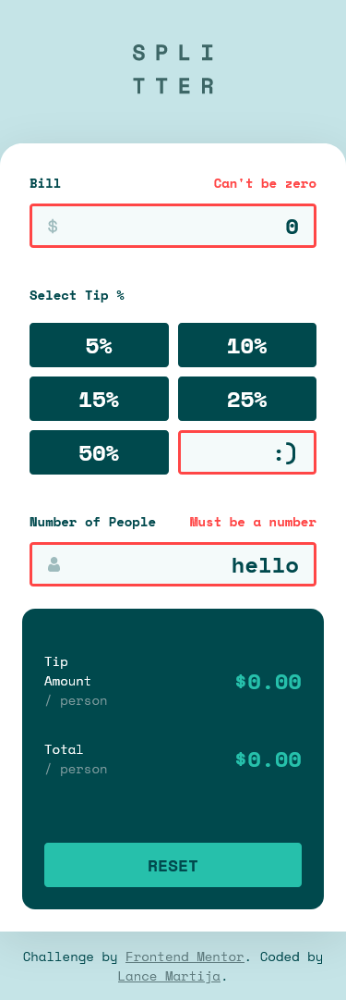

# Frontend Mentor - Tip calculator app solution

This is a solution to the [Tip calculator app challenge on Frontend Mentor](https://www.frontendmentor.io/challenges/tip-calculator-app-ugJNGbJUX). Frontend Mentor challenges help you improve your coding skills by building realistic projects.

## Table of contents

- [Overview](#overview)
  - [The challenge](#the-challenge)
  - [Screenshot](#screenshot)
  - [Links](#links)
- [My process](#my-process)
  - [Built with](#built-with)
  - [What I learned](#what-i-learned)
  - [Continued development](#continued-development)
  - [Useful resources](#useful-resources)
- [Author](#author)
- [Acknowledgments](#acknowledgments)

## Overview

### The challenge

Users should be able to:

- View the optimal layout for the app depending on their device's screen size
- See hover states for all interactive elements on the page
- Calculate the correct tip and total cost of the bill per person

### Screenshot

### Links

- Github Repo URL: [Tip Calculator App Repository](https://github.com/lancemartija/TipCalculatorApp)
- Live Site URL: [Tip Calculator App](https://lancemartija.github.io/TipCalculatorApp/)

## My process

### Built with

- Semantic HTML5 markup
- SASS 
- Flexbox
- CSS Grid
- Mobile-first workflow
 - Vanilla JavaScript

### What I learned

I learned a lot about developing a website with "Mobile-first" in mind. I think it made things a bit easier to visualize and map out despite working with a particularly small viewport. I was also able to apply most of my learnings about SASS, though I still have to work on how I lay down its structures properly. I used BEM as my naming conventions for my classes and I'm sure I made quite a mess with it LOL! I still have a long way to go to learn better semantics in both HTML and CSS, and in JavaScript as well.

Speaking of JavaScript, this is my second time working with it and my first time developing a website from scratch using only Vanilla JS without looking through any tutorials (except for some articles about the use of certain functions and methods). I think it was a bad idea not watching through tutorials on YouTube first, but its still quite an experience working on the logic of this website with literally having zero experience with JavaScript.

All in all, I learned a lot with this project and I sure hope I'll go the distance and learn more about JavaScript and its frameworks.

### Continued development

As I mentioned earlier, this is my first time developing a website using Vanilla JS, so I would like to improve my JavaScript skills by implementing its best practices.

### Useful resources

- [Coder Coder](https://www.youtube.com/c/TheCoderCoder) - This youtuber inspired me to take on projects like this (Tip Calculator App) and gave me the motivation to start developing websites.
- [W3Schools](https://www.w3schools.com/) - Of course, who could forget about one of the greatest websites ever created? W3Schools helped me learn ways to improve my flex and grid skills.

## Author

- Website - [Lance Martija](https://github.com/lancemartija)
- Frontend Mentor - [@lancemartija](https://www.frontendmentor.io/profile/lancemartija)
- Twitter - [@lancemartija](https://twitter.com/lancemartija)

## Acknowledgments

I would like to thank Coder Coder for inspiring me to pursue front-end development. A huge shoutout to WebDev Twitter and their great tips and tricks about JavaScript, CSS, and HTML!
